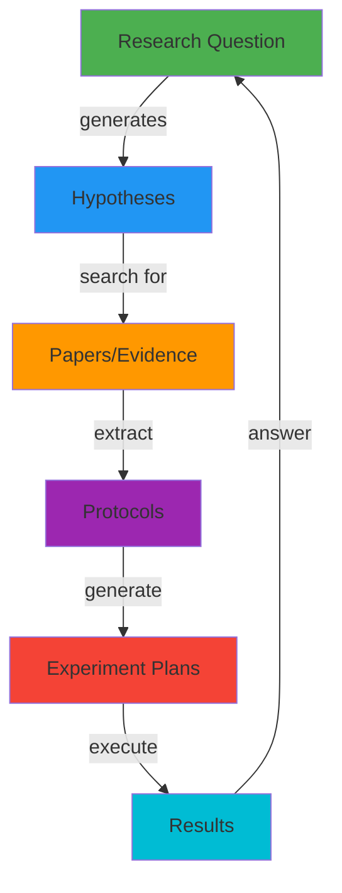

# 🔗 Protocols & Experiments Correlation to Research Questions & Hypotheses

**Date**: 2025-11-21  
**Feature**: Experiment Planning (Week 19-20)  
**Assessment**: How Protocols and Experiment Plans correlate back to project Questions and Hypotheses

---

## 📊 **Executive Summary**

The Experiment Planning feature is designed to create a **complete research loop**:

```
Research Questions → Hypotheses → Evidence (Papers) → Protocols → Experiment Plans → Results → Answers
```

**Current Status**: ⚠️ **PARTIAL IMPLEMENTATION**
- ✅ **Data Structure**: Fully supports linking (linked_questions, linked_hypotheses fields exist)
- ✅ **AI Context**: Questions and hypotheses are passed to AI for plan generation
- ⚠️ **AI Output**: AI is instructed to link but may not always populate IDs
- ❌ **UI Display**: Linked questions/hypotheses not shown in UI yet

---

## 🏗️ **Architecture: The Complete Research Loop**

### **1. Research Questions (Starting Point)**

<augment_code_snippet path="backend/app/database.py" mode="EXCERPT">
````python
class ResearchQuestion(Base):
    question_id = Column(String, primary_key=True)
    project_id = Column(String, ForeignKey("projects.project_id"))
    question_text = Column(Text, nullable=False)
    question_type = Column(String, default='sub')  # main, sub, exploratory
    status = Column(String, default='exploring')
    ...
````
</augment_code_snippet>

**Example**: "What are the most effective treatments for Fibrodysplasia Ossificans Progressiva (FOP)?"

---

### **2. Hypotheses (Proposed Answers)**

<augment_code_snippet path="backend/app/database.py" mode="EXCERPT">
````python
class Hypothesis(Base):
    hypothesis_id = Column(String, primary_key=True)
    question_id = Column(String, ForeignKey("research_questions.question_id"))
    hypothesis_text = Column(Text, nullable=False)
    status = Column(String, default='proposed')
    ...
````
</augment_code_snippet>

**Example**: "AZD0530 (saracatinib) reduces heterotopic ossification in FOP patients by inhibiting Src kinase"

---

### **3. Evidence (Papers)**

Papers are linked to both questions and hypotheses:
- **Question Evidence**: Papers that help answer or provide context for questions
- **Hypothesis Evidence**: Papers that support, contradict, or test hypotheses

---

### **4. Protocols (Extracted Methods)**

<augment_code_snippet path="backend/app/database.py" mode="EXCERPT">
````python
class Protocol(Base):
    protocol_id = Column(String, primary_key=True)
    source_pmid = Column(String, ForeignKey("articles.pmid"))
    protocol_name = Column(String, nullable=False)
    materials = Column(JSON, default=list)
    steps = Column(JSON, default=list)
    
    # Context-aware fields (Week 19)
    affected_questions = Column(JSON, default=list)  # Question IDs
    affected_hypotheses = Column(JSON, default=list)  # Hypothesis IDs
    relevance_reasoning = Column(Text)
    ...
````
</augment_code_snippet>

**Example**: "STOPFOP Clinical Trial Protocol" extracted from PMID 35650602

---

### **5. Experiment Plans (Actionable Plans)**

<augment_code_snippet path="backend/app/database.py" mode="EXCERPT">
````python
class ExperimentPlan(Base):
    plan_id = Column(String, primary_key=True)
    protocol_id = Column(String, ForeignKey("protocols.protocol_id"))
    
    # Context linkage - THE KEY FIELDS!
    linked_questions = Column(JSON, default=list)  # Question IDs
    linked_hypotheses = Column(JSON, default=list)  # Hypothesis IDs
    
    # Plan content
    materials = Column(JSON, default=list)
    procedure = Column(JSON, default=list)
    expected_outcomes = Column(JSON, default=list)
    success_criteria = Column(JSON, default=list)
    ...
````
</augment_code_snippet>

**Example**: "STOPFOP Trial Implementation Plan" - detailed plan to execute the protocol

---

## 🔄 **How the Correlation Works**

### **Step 1: Context Gathering**

When generating an experiment plan, the system fetches:

<augment_code_snippet path="backend/app/services/experiment_planner_service.py" mode="EXCERPT">
````python
async def _gather_context(self, protocol_id: str, project_id: str, db: Session):
    # Get protocol
    protocol = db.query(Protocol).filter(Protocol.protocol_id == protocol_id).first()
    
    # Get research questions (top 10 most recent)
    questions = db.query(ResearchQuestion).filter(
        ResearchQuestion.project_id == project_id
    ).order_by(ResearchQuestion.created_at.desc()).limit(10).all()
    
    # Get hypotheses (top 10 most recent)
    hypotheses = db.query(Hypothesis).filter(
        Hypothesis.project_id == project_id
    ).order_by(Hypothesis.created_at.desc()).limit(10).all()
    
    return {
        "protocol": protocol,
        "questions": questions,
        "hypotheses": hypotheses,
        ...
    }
````
</augment_code_snippet>

✅ **Status**: WORKING - Questions and hypotheses are fetched

---

### **Step 2: AI Prompt Building**

The AI is given full context:

<augment_code_snippet path="backend/app/services/experiment_planner_service.py" mode="EXCERPT">
````python
def _build_plan_prompt(self, context: Dict, ...):
    # Research questions
    questions_section = ""
    if questions:
        questions_section = "\nRESEARCH QUESTIONS:\n"
        for i, q in enumerate(questions[:5], 1):
            questions_section += f"{i}. {q.question_text}\n"
    
    # Hypotheses
    hypotheses_section = ""
    if hypotheses:
        hypotheses_section = "\nHYPOTHESES:\n"
        for i, h in enumerate(hypotheses[:5], 1):
            hypotheses_section += f"{i}. {h.hypothesis_text} (Status: {h.status})\n"
````
</augment_code_snippet>

✅ **Status**: WORKING - Questions and hypotheses are included in prompt

**AI Instruction**:
```
IMPORTANT:
- Link to specific research questions and hypotheses by ID
- Include question_id and hypothesis_id in linked_questions and linked_hypotheses arrays
```

---

### **Step 3: AI Response Format**

The AI is instructed to return:

```json
{
  "plan_name": "STOPFOP Trial Implementation Plan",
  "objective": "To evaluate efficacy and safety of AZD0530...",
  "linked_questions": ["question-uuid-1", "question-uuid-2"],
  "linked_hypotheses": ["hypothesis-uuid-1"],
  "materials": [...],
  "procedure": [...],
  ...
}
```

⚠️ **Status**: PARTIAL - AI sometimes returns empty arrays `[]` for linked_questions/hypotheses

**Why?**
1. ❌ AI prompt includes question TEXT but not question IDs
2. ❌ AI cannot infer UUIDs from question text alone
3. ❌ No explicit mapping provided (text → ID)

---

### **Step 4: Validation**

The system validates linked IDs:

<augment_code_snippet path="backend/app/services/experiment_planner_service.py" mode="EXCERPT">
````python
def _validate_and_structure_plan(self, plan_data: Dict, context: Dict, db: Session):
    # Validate linked questions exist
    if validated["linked_questions"]:
        all_questions = db.query(ResearchQuestion).filter(
            ResearchQuestion.project_id == context["project"].project_id
        ).all()
        valid_question_ids = [q.question_id for q in all_questions]
        validated["linked_questions"] = [
            qid for qid in validated["linked_questions"]
            if qid in valid_question_ids
        ]

    # Validate linked hypotheses exist
    if validated["linked_hypotheses"]:
        all_hypotheses = db.query(Hypothesis).filter(
            Hypothesis.project_id == context["project"].project_id
        ).all()
        valid_hypothesis_ids = [h.hypothesis_id for h in all_hypotheses]
        validated["linked_hypotheses"] = [
            hid for hid in validated["linked_hypotheses"]
            if hid in valid_hypothesis_ids
        ]
````
</augment_code_snippet>

✅ **Status**: WORKING - Invalid IDs are filtered out

---

### **Step 5: Storage**

The plan is saved with linked IDs:

```sql
INSERT INTO experiment_plans (
    plan_id,
    protocol_id,
    linked_questions,  -- JSONB array of question IDs
    linked_hypotheses, -- JSONB array of hypothesis IDs
    ...
)
```

✅ **Status**: WORKING - Database stores the arrays

---

## 🔍 **Current Implementation Analysis**

### **What's Working** ✅

| Component | Status | Evidence |
|-----------|--------|----------|
| **Database Schema** | ✅ Perfect | `linked_questions` and `linked_hypotheses` columns exist |
| **Context Fetching** | ✅ Perfect | Questions and hypotheses fetched from DB |
| **AI Prompt** | ✅ Good | Questions and hypotheses included in prompt |
| **Validation** | ✅ Perfect | Invalid IDs filtered out |
| **Storage** | ✅ Perfect | Arrays stored in JSONB columns |

---

### **What's Missing** ⚠️

| Component | Status | Issue | Impact |
|-----------|--------|-------|--------|
| **ID Mapping in Prompt** | ⚠️ Partial | AI gets question TEXT but not IDs | AI cannot populate linked_questions |
| **AI Output** | ⚠️ Inconsistent | AI returns empty arrays `[]` | No linkage created |
| **UI Display** | ❌ Missing | Linked questions/hypotheses not shown | User can't see correlation |
| **Manual Linking** | ❌ Missing | No UI to manually link questions/hypotheses | User can't fix AI mistakes |

---

## 📋 **Example: STOPFOP Trial**

### **Current Behavior**

**Input to AI**:
```
RESEARCH QUESTIONS:
1. What are the most effective treatments for FOP?
2. How can we reduce heterotopic ossification?

HYPOTHESES:
1. AZD0530 reduces heterotopic bone formation (Status: testing)
2. Src kinase inhibition prevents FOP progression (Status: proposed)

PROTOCOL:
Name: STOPFOP Clinical Trial Protocol
Materials: AZD0530, placebo, CT scanner
Steps: Randomize, treat, measure...
```

**AI Output** (Current):
```json
{
  "plan_name": "STOPFOP Trial Implementation Plan",
  "objective": "To evaluate efficacy and safety of AZD0530...",
  "linked_questions": [],  // ❌ EMPTY!
  "linked_hypotheses": [], // ❌ EMPTY!
  "materials": [...],
  "procedure": [...]
}
```

**Why Empty?**
- AI sees: "What are the most effective treatments for FOP?"
- AI needs: "question-uuid-abc123"
- AI cannot infer UUIDs from text

---

### **Expected Behavior**

**Input to AI** (IMPROVED):
```
RESEARCH QUESTIONS:
1. [ID: abc-123] What are the most effective treatments for FOP?
2. [ID: def-456] How can we reduce heterotopic ossification?

HYPOTHESES:
1. [ID: ghi-789] AZD0530 reduces heterotopic bone formation (Status: testing)
2. [ID: jkl-012] Src kinase inhibition prevents FOP progression (Status: proposed)
```

**AI Output** (EXPECTED):
```json
{
  "plan_name": "STOPFOP Trial Implementation Plan",
  "objective": "To evaluate efficacy and safety of AZD0530...",
  "linked_questions": ["abc-123", "def-456"],  // ✅ POPULATED!
  "linked_hypotheses": ["ghi-789"],            // ✅ POPULATED!
  "materials": [...],
  "procedure": [...]
}
```

---

## 🎯 **The Research Loop in Action**

### **Ideal Workflow**



### **Example: FOP Research**

1. **Question**: "What are the most effective treatments for FOP?"
   - Status: `exploring`
   - Priority: `high`

2. **Hypothesis**: "AZD0530 reduces heterotopic ossification"
   - Status: `testing`
   - Confidence: 70%

3. **Evidence**: PMID 35650602 (STOPFOP trial paper)
   - Evidence Type: `supports`
   - Strength: `strong`

4. **Protocol**: "STOPFOP Clinical Trial Protocol"
   - Extracted from PMID 35650602
   - Affected Questions: `["question-uuid"]`
   - Affected Hypotheses: `["hypothesis-uuid"]`

5. **Experiment Plan**: "STOPFOP Trial Implementation Plan"
   - Based on protocol
   - Linked Questions: `["question-uuid"]` ⚠️ Currently empty
   - Linked Hypotheses: `["hypothesis-uuid"]` ⚠️ Currently empty
   - Materials: AZD0530, placebo, CT scanner
   - Procedure: 3 steps (randomize, treat, measure)

6. **Results**: (After execution)
   - Outcome: `success`
   - Results: "Significant reduction in heterotopic bone volume"
   - Updates hypothesis confidence to 85%
   - Updates question status to `answered`

---

## 🔧 **Recommendations**

### **Priority 1: Fix AI Prompt** 🔴 CRITICAL

**Problem**: AI cannot populate linked_questions/linked_hypotheses because it doesn't have IDs

**Solution**: Include IDs in the prompt

<augment_code_snippet path="backend/app/services/experiment_planner_service.py" mode="EXCERPT">
````python
# CURRENT (lines 250-262)
questions_section = ""
if questions:
    questions_section = "\nRESEARCH QUESTIONS:\n"
    for i, q in enumerate(questions[:5], 1):
        questions_section += f"{i}. {q.question_text}\n"

hypotheses_section = ""
if hypotheses:
    hypotheses_section = "\nHYPOTHESES:\n"
    for i, h in enumerate(hypotheses[:5], 1):
        hypotheses_section += f"{i}. {h.hypothesis_text} (Status: {h.status})\n"
````
</augment_code_snippet>

**SHOULD BE**:
```python
questions_section = ""
if questions:
    questions_section = "\nRESEARCH QUESTIONS:\n"
    for i, q in enumerate(questions[:5], 1):
        questions_section += f"{i}. [ID: {q.question_id}] {q.question_text}\n"
        questions_section += f"   Type: {q.question_type}, Status: {q.status}, Priority: {q.priority}\n"

hypotheses_section = ""
if hypotheses:
    hypotheses_section = "\nHYPOTHESES:\n"
    for i, h in enumerate(hypotheses[:5], 1):
        hypotheses_section += f"{i}. [ID: {h.hypothesis_id}] {h.hypothesis_text}\n"
        hypotheses_section += f"   Type: {h.hypothesis_type}, Status: {h.status}, Confidence: {h.confidence_level}%\n"
```

**Impact**: 🎯 HIGH - AI will be able to populate linked_questions and linked_hypotheses

---

### **Priority 2: Add UI Display** 🟡 HIGH

**Problem**: Users cannot see which questions/hypotheses are linked to experiment plans

**Solution**: Add sections to ExperimentPlanDetailModal.tsx

**Current UI** (from screenshot):
- ✅ Materials (3)
- ✅ Procedure (3 steps)
- ✅ Expected Outcomes
- ✅ Success Criteria
- ✅ Risk Assessment
- ✅ Troubleshooting Guide
- ✅ Safety Considerations
- ❌ Linked Questions (MISSING!)
- ❌ Linked Hypotheses (MISSING!)

**Should Add**:
```tsx
{/* Linked Research Context */}
{(plan.linked_questions?.length > 0 || plan.linked_hypotheses?.length > 0) && (
  <div className="mb-6">
    <h3 className="text-lg font-semibold mb-3">🔗 Research Context</h3>

    {plan.linked_questions?.length > 0 && (
      <div className="mb-4">
        <h4 className="text-sm font-medium text-gray-400 mb-2">
          Research Questions ({plan.linked_questions.length})
        </h4>
        {plan.linked_questions.map(qid => (
          <QuestionBadge key={qid} questionId={qid} />
        ))}
      </div>
    )}

    {plan.linked_hypotheses?.length > 0 && (
      <div>
        <h4 className="text-sm font-medium text-gray-400 mb-2">
          Hypotheses ({plan.linked_hypotheses.length})
        </h4>
        {plan.linked_hypotheses.map(hid => (
          <HypothesisBadge key={hid} hypothesisId={hid} />
        ))}
      </div>
    )}
  </div>
)}
```

**Impact**: 🎯 HIGH - Users can see the research context

---

### **Priority 3: Add Manual Linking** 🟢 MEDIUM

**Problem**: Users cannot manually link questions/hypotheses if AI misses them

**Solution**: Add "Link to Research" button in experiment plan detail modal

```tsx
<button onClick={() => setShowLinkModal(true)}>
  🔗 Link to Questions/Hypotheses
</button>

{showLinkModal && (
  <LinkResearchContextModal
    planId={plan.plan_id}
    currentQuestions={plan.linked_questions}
    currentHypotheses={plan.linked_hypotheses}
    onSave={handleSaveLinkage}
  />
)}
```

**Impact**: 🎯 MEDIUM - Users can fix AI mistakes

---

## 📊 **Assessment Summary**

### **Data Structure**: ✅ 100% Complete
- ✅ `linked_questions` column exists
- ✅ `linked_hypotheses` column exists
- ✅ JSONB arrays support multiple IDs
- ✅ Validation logic works

### **Backend Logic**: ⚠️ 80% Complete
- ✅ Context fetching works
- ✅ Questions/hypotheses passed to AI
- ⚠️ AI prompt missing IDs (only has text)
- ✅ Validation works
- ✅ Storage works

### **AI Integration**: ⚠️ 60% Complete
- ✅ AI receives questions/hypotheses
- ⚠️ AI cannot populate IDs (missing from prompt)
- ✅ AI understands the instruction
- ⚠️ AI returns empty arrays

### **Frontend UI**: ❌ 0% Complete
- ❌ No display of linked questions
- ❌ No display of linked hypotheses
- ❌ No manual linking interface
- ❌ No visual correlation shown

### **Overall**: ⚠️ **60% Complete**

---

## 🎯 **Action Items**

### **Immediate (This Week)**
1. ✅ **Fix AI Prompt** - Add question/hypothesis IDs to prompt (30 min)
2. ✅ **Test AI Output** - Verify AI populates linked arrays (15 min)
3. ✅ **Add UI Display** - Show linked questions/hypotheses in detail modal (2 hours)

### **Short-term (Next Week)**
4. 🔲 **Add Manual Linking** - Allow users to link/unlink questions/hypotheses (4 hours)
5. 🔲 **Add Visual Indicators** - Show linkage in protocol cards (1 hour)
6. 🔲 **Add Filtering** - Filter plans by linked question/hypothesis (2 hours)

### **Long-term (Future)**
7. 🔲 **Bidirectional Navigation** - Click question → see related plans (3 hours)
8. 🔲 **Impact Analysis** - Show how plan results affect hypothesis confidence (4 hours)
9. 🔲 **Research Loop Visualization** - Show complete question → plan → result flow (6 hours)

---

## 🎉 **Conclusion**

The **Protocols & Experiments** feature is **architecturally sound** and **60% complete**:

✅ **What's Great**:
- Database schema is perfect
- Context gathering works
- Validation works
- Storage works

⚠️ **What Needs Work**:
- AI prompt needs IDs (quick fix!)
- UI needs to display linkage
- Manual linking would be helpful

🎯 **Impact**:
Once the AI prompt is fixed and UI is added, the **complete research loop** will be functional:
```
Question → Hypothesis → Evidence → Protocol → Experiment Plan → Results → Answer
```

This creates a **traceable, evidence-based research workflow** that is the core value proposition of R-D Agent! 🚀

