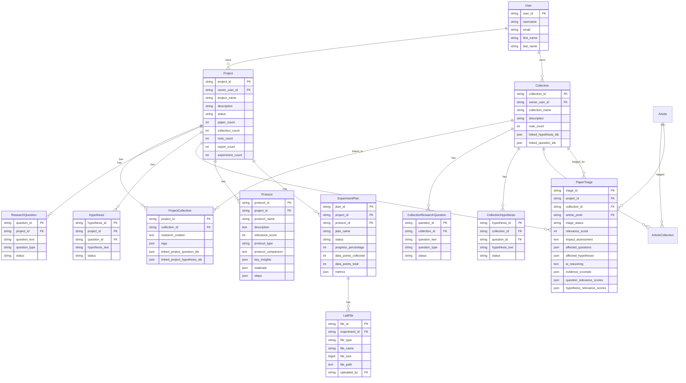

# Technical Architecture Changes - Erythos Restructuring

**Date**: 2025-11-28  
**Status**: Implementation Planning  
**Scope**: Complete technical architecture for Erythos restructuring

---

## 🏗️ **Architecture Overview**

### **Current Architecture**

```
Frontend (Next.js 15.5.4 + React + TypeScript)
├── Pages (7 routes)
│   ├── /home - Landing page
│   ├── /search - Search interface
│   ├── /discover - Recommendations
│   ├── /collections - Collection management
│   ├── /dashboard - Projects overview
│   ├── /project/[id] - Project workspace (6 tabs with sub-tabs)
│   └── /lab - Lab protocols (project-scoped)
│
├── Components
│   ├── Shared (UnifiedHeroSection, SpotifyProjectTabs, etc.)
│   └── Page-specific
│
└── Styling
    ├── Tailwind CSS
    └── CSS Variables (Spotify theme - green)

Backend (Python + FastAPI)
├── Routers
│   ├── /projects - Project management
│   ├── /collections - Collection management
│   ├── /project/{id}/triage - Project-specific triage
│   ├── /protocols - Lab protocols
│   └── /experiments - Experiments
│
├── Services
│   ├── AITriageService - Standard triage
│   └── EnhancedAITriageService - Multi-agent triage
│
└── Database (PostgreSQL)
    ├── Projects (one-to-many with Collections)
    ├── Collections
    ├── PaperTriage (project_id only)
    └── ResearchQuestions/Hypotheses (project-level only)
```

### **Target Architecture**

```
Frontend (Next.js 15.5.4 + React + TypeScript)
├── Pages (5 routes - consolidated)
│   ├── /home - Simplified landing (4 workflow cards)
│   ├── /discover - Unified discovery (3 tabs: Smart Inbox, Explore, All Papers)
│   ├── /collections - Simplified collection list (flat, no grouping)
│   ├── /projects - Projects overview (renamed from /dashboard)
│   ├── /project/[id] - Project workspace (7 flat tabs, no sub-tabs)
│   └── /lab - Global lab page (3 tabs: Protocols, Experiments, Data Management)
│
├── Components
│   ├── Erythos Shared (ErythosHeader, ErythosCard, ErythosTabs, etc.)
│   └── Page-specific (SmartInboxTab, ExploreTab, AllPapersTab, etc.)
│
└── Styling
    ├── Tailwind CSS
    └── CSS Variables (Erythos theme - red/purple/orange)

Backend (Python + FastAPI)
├── Routers
│   ├── /projects - Project management (enhanced with counts)
│   ├── /collections - Collection management (enhanced with note_count)
│   ├── /triage - Global triage (collection-centric) ← NEW
│   ├── /project/{id}/triage - Project-specific triage (deprecated)
│   ├── /protocols - Lab protocols (enhanced with relevance, type, insights)
│   ├── /experiments - Experiments (enhanced with progress, metrics)
│   └── /lab/files - Lab file management ← NEW
│
├── Services
│   ├── GlobalTriageService - Collection-centric triage ← NEW
│   ├── AITriageService - Standard triage (kept for backward compat)
│   └── EnhancedAITriageService - Multi-agent triage (kept)
│
└── Database (PostgreSQL)
    ├── Projects (many-to-many with Collections via ProjectCollection)
    ├── Collections (enhanced with note_count)
    ├── ProjectCollection (junction table - Phase 0)
    ├── PaperTriage (project_id + collection_id) ← ENHANCED
    ├── ResearchQuestions/Hypotheses (project-level)
    ├── CollectionResearchQuestions/Hypotheses (collection-level - Phase 0)
    ├── Protocols (enhanced with relevance_score, protocol_type, etc.)
    ├── ExperimentPlans (enhanced with progress, metrics)
    └── LabFiles (new table for file management) ← NEW
```

---

## 🔄 **Data Flow Changes**

### **1. AI Triage Flow**

**Current Flow** (Project-Centric):
```
User → Search Papers → View Paper → Click "Triage" (in project context)
  ↓
Backend: POST /project/{project_id}/triage
  ↓
1. Get project's questions & hypotheses
2. Analyze paper against project Q&H
3. Store triage in PaperTriage (project_id only)
  ↓
User → View in Project Workspace → Papers → Smart Inbox
```

**Target Flow** (Collection-Centric):
```
User → Discover → All Papers → Search → View Paper → Click "AI Triage"
  ↓
Backend: POST /triage (global)
  ↓
1. Get ALL collections
2. For each collection:
   a. Get linked projects via ProjectCollection
   b. Get project-level Q&H
   c. Get collection-level Q&H
3. Analyze paper against ALL Q&H
4. Store triage in PaperTriage (project_id + collection_id)
5. Return affected_collections[] and affected_projects[]
  ↓
User → Discover → Smart Inbox → View triaged papers (global)
```

**Key Changes**:
- Triage is no longer project-scoped
- Scans across ALL collections
- Returns multiple affected collections/projects
- Smart Inbox is global (not project-specific)

---

### **2. Navigation Flow**

**Current Flow**:
```
Home → Multiple entry points
  ├── Search (dedicated page)
  ├── Discover (recommendations page)
  ├── Collections (management page)
  ├── Dashboard (projects overview)
  ├── Project Workspace (6 tabs with sub-tabs)
  │   ├── Dashboard (widgets)
  │   ├── Research (Questions, Hypotheses, Evidence, Decisions)
  │   ├── Papers (Inbox, Explore, Collections)
  │   ├── Lab (Protocols, Experiments, Summaries)
  │   ├── Notes (Ideas, Annotations, Comments)
  │   └── Analysis (Reports, Insights, Timeline)
  └── Lab (project-scoped protocols)
```

**Target Flow**:
```
Home → 4 workflow cards
  ├── Discover (3 tabs)
  │   ├── Smart Inbox (global triaged papers)
  │   ├── Explore (hypothesis cascade)
  │   └── All Papers (search + AI summary)
  ├── Collections (flat list)
  ├── Projects (overview)
  │   └── Project Workspace (7 flat tabs)
  │       ├── Overview (progress, insights, milestones, activity)
  │       ├── Questions & Hypotheses (single view)
  │       ├── Collections (project-specific collections)
  │       ├── Lab Progress (metrics, timeline, experiments)
  │       ├── Decisions (timeline)
  │       ├── Team (members)
  │       └── Reports (generated reports)
  └── Lab (global, 3 tabs)
      ├── Protocols (all protocols with project filter)
      ├── Experiments (all experiments with project filter)
      └── Data Management (file storage)
```

**Key Changes**:
- Consolidated discovery (Search + Discover + Smart Inbox → Discover)
- Flattened project tabs (6 tabs with sub-tabs → 7 flat tabs)
- Elevated Lab to global (project-scoped → global with filter)
- Simplified navigation (7+ routes → 5 routes)

---

## 🗄️ **Database Architecture**

### **Entity Relationship Diagram**



---

## 🔌 **API Architecture**

### **RESTful API Endpoints**

#### **Projects**

```
GET    /projects                    - List all projects
GET    /projects/{id}               - Get project detail (with counts)
POST   /projects                    - Create project
PUT    /projects/{id}               - Update project
DELETE /projects/{id}               - Delete project
```

#### **Collections**

```
GET    /collections                 - List all collections (with note_count)
GET    /collections/{id}            - Get collection detail
POST   /collections                 - Create collection
PUT    /collections/{id}            - Update collection
DELETE /collections/{id}            - Delete collection
```

#### **AI Triage** (NEW + DEPRECATED)

```
POST   /triage                      - Global AI triage (collection-centric) ← NEW
GET    /triage                      - Get all triaged papers (global) ← NEW
GET    /triage/{id}                 - Get triage detail ← NEW
PUT    /triage/{id}                 - Update triage status ← NEW

POST   /project/{id}/triage         - Project-specific triage ← DEPRECATED
GET    /project/{id}/triage         - Get project triages ← DEPRECATED
```

#### **Lab**

```
GET    /protocols                   - List all protocols (with filters)
GET    /protocols/{id}              - Get protocol detail
POST   /protocols                   - Create protocol
PUT    /protocols/{id}              - Update protocol
DELETE /protocols/{id}              - Delete protocol

GET    /experiments                 - List all experiments (with filters)
GET    /experiments/{id}            - Get experiment detail
POST   /experiments                 - Create experiment
PUT    /experiments/{id}            - Update experiment
DELETE /experiments/{id}            - Delete experiment

POST   /lab/files                   - Upload lab file ← NEW
GET    /lab/files                   - List lab files (with filters) ← NEW
GET    /lab/files/{id}              - Get file detail ← NEW
DELETE /lab/files/{id}              - Delete file ← NEW
```

---

## 🎨 **Component Architecture**

### **Shared Components (Erythos)**

```
frontend/src/components/erythos/
├── ErythosHeader.tsx              - Header with 5-item nav
├── ErythosCard.tsx                - Base card with gradient backgrounds
├── ErythosButton.tsx              - Button with red accent
├── ErythosTabs.tsx                - Tab component with badges
├── ErythosSearchBar.tsx           - Centered search bar with tags
├── ErythosWorkflowCard.tsx        - Workflow card with gradient icon
├── ErythosStatsCard.tsx           - Stats card for metrics
├── ErythosProgressBar.tsx         - Progress bar component
└── ErythosStatusIndicator.tsx     - Pulsing dot indicator
```

### **Page-Specific Components**

```
frontend/src/components/
├── home/
│   ├── SimplifiedHero.tsx         - Greeting + subtitle
│   ├── CenteredSearch.tsx         - Search bar with quick tags
│   └── WorkflowGrid.tsx           - 4 workflow cards in 2x2 grid
│
├── discover/
│   ├── SmartInboxTab.tsx          - Global triaged papers
│   ├── ExploreTab.tsx             - Hypothesis cascade
│   ├── AllPapersTab.tsx           - Search + AI summary
│   ├── TriagedPaperCard.tsx       - Enhanced paper card with triage info
│   └── AISearchSummary.tsx        - AI-generated search summary
│
├── collections/
│   ├── SimplifiedHeader.tsx       - 2-line header
│   ├── FlatCollectionList.tsx     - Flat list (no grouping)
│   └── EnhancedCollectionCard.tsx - Larger icons, gradients, note count
│
├── projects/
│   ├── SimplifiedProjectHeader.tsx - Title + status + meta
│   ├── StatsGrid.tsx              - 5 stats cards (always visible)
│   ├── OverviewTab.tsx            - Progress, insights, milestones, activity
│   ├── QuestionsHypothesesTab.tsx - Single view (no sub-tabs)
│   ├── CollectionsTab.tsx         - Project-specific collections
│   ├── LabProgressTab.tsx         - Metrics, timeline, experiments
│   ├── DecisionsTab.tsx           - Decision timeline
│   ├── TeamTab.tsx                - Team members
│   └── ReportsTab.tsx             - Generated reports
│
└── lab/
    ├── ProtocolsTab.tsx           - All protocols with project filter
    ├── ExperimentsTab.tsx         - All experiments with project filter
    ├── DataManagementTab.tsx      - File storage (3 sections)
    ├── EnhancedProtocolCard.tsx   - Relevance, type, comparison, insights
    ├── EnhancedExperimentCard.tsx - Progress, metrics, status indicator
    ├── FileItem.tsx               - File list item
    └── PhotoItem.tsx              - Photo grid item
```

---

## 🔐 **Security & Authentication**

### **Current**
- User-ID header for authentication
- No role-based access control (RBAC)
- No API rate limiting

### **Target** (No changes for now, but recommendations)
- Keep User-ID header authentication
- **Recommendation**: Add RBAC for team collaboration
- **Recommendation**: Add rate limiting for AI triage endpoint
- **Recommendation**: Add file upload size limits

---

## 📊 **Performance Considerations**

### **Caching Strategy**

```
Frontend (React Query):
- Cache project details (5 min)
- Cache collection list (5 min)
- Cache triaged papers (1 min)
- Invalidate on mutations

Backend (Redis - optional):
- Cache AI triage results (1 hour)
- Cache project counts (5 min)
- Cache collection counts (5 min)
```

### **Pagination**

```
All list endpoints should support pagination:
- GET /collections?page=1&limit=20
- GET /triage?page=1&limit=20
- GET /protocols?page=1&limit=20
- GET /experiments?page=1&limit=20
- GET /lab/files?page=1&limit=50
```

### **Lazy Loading**

```
Frontend:
- Lazy load tab content (only load active tab)
- Lazy load images (use next/image)
- Lazy load large components (React.lazy)
```

---

**Status**: ✅ **TECHNICAL ARCHITECTURE DOCUMENTED**  
**Next**: Review and approve before implementation


